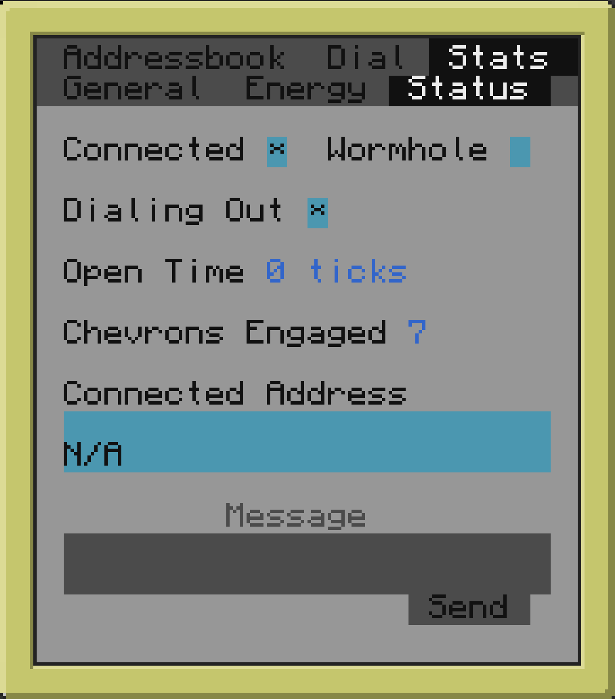

# Pocket Stargate

A small program for [CC:Tweaked mod](https://github.com/cc-tweaked/CC-Tweaked/) that aims to make using the stargate from [Stargate Journey mod](https://github.com/Povstalec/StargateJourney/) comfortable.

This program is designed for use on an advanced pocket computer with a wireless modem installed. It communicates with the stargate remotelly.

This program consists of server and client sides.

Server side should be installed via [install_server.lua](install_server.lua) script on a normal computer. A stargate interface (basic interface, crystal interface or advanced crystal interface) and a wireless modem should be attached to this computer.

Server installer will ask you some questions about the location of the stargate. This information is used to optimise an addressbook on the client side. So you will see only the addresses that you actually can dial from this stargate.

Client side should be installed via [install_client.lua](install_client.lua) script on an advanced pocket computer with a wireles modem module. The client side is already packed with an addressbook that is stored in the [addresses.conf](client/addresses.conf) file. You can modify this file for your needs.

The client side uses [Basalt](https://github.com/Pyroxenium/Basalt) framework for UI.

## Installation

### Server

1. Locate the stargate.
2. Attach a basic interface, a crystal interface or an advanced crystal interface block to the stargate.
3. Attach a computer block to the interface.
4. Attach a wireless modem block to the computer block.
5. Run the following command in the placed computer:
    ```
    wget run https://raw.githubusercontent.com/Ktlo/pocket-stargate/develop/install_server.lua
    ```
6. Follow the installation steps.

### Client

1. Craft an advanced pocket computer with wireless module.
2. Run the following command in the pocket computer:
    ```
    wget run https://raw.githubusercontent.com/Ktlo/pocket-stargate/develop/install_client.lua
    ```
3. Modify the *addresses.conf* file after the installation procedure is finished.
4. Run `psg` command in the pocket computer.

## Features

### Addressbook


This tab shows the addresses that you can dial from the stargate. It doesn't show you all the content of the *addresses.conf* file.

All addresses are categorized into three tabs. The first one shows 7-symbol addresses. The second one shows 8-symbol addresses. The last one shows 9-symbol addresses.

This is the first tab that you will see upon running this program near the stargate. It is expected to be the most usefull feature of Pocket Stargate.

### Dialer


You can use this tab instead of a DHD block. Moreover this tab shows currently dialed address and symbols that are ready to be encoded in the next chevrons. The reset button will stop any dialing sequence immediately.

### Stats: General


This tab shows the general information about the stargate. It can also modify its network id and make it restricted to the said network.

Some values are only showed when you use a higher tier stargate interface block on the server side. For example, basic interface will not show you the local address of the stargate, but advanced crystal interface will have an access to this information so it will be shown on this tab.

### Stats: Energy


This tab shows energy properties of the stargate and the stargate interface. You can also change the target energy value from there.

### Stats: Status



This tab shows the current stargate connection state.

You can send message through the stargate connection by writing in the buttom text field and pressing *Send* button. The sent message will be shown on the other side via popup window.
