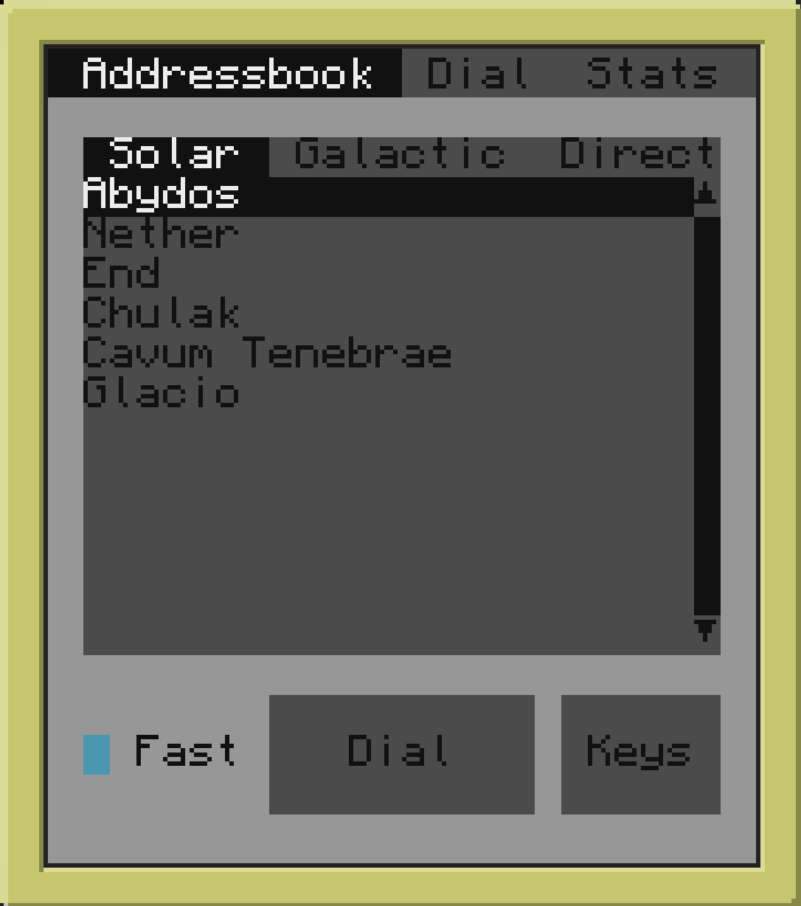

# Pocket Stargate

A small program for [CC:Tweaked mod](https://github.com/cc-tweaked/CC-Tweaked/) that aims to make using the stargate from [Stargate Journey mod](https://github.com/Povstalec/StargateJourney/) comfortable.

This program is designed for use on an advanced pocket computer with a wireless modem installed. It communicates with the stargate remotelly.

This program consists of server (SGS) and client (PSG) sides.

Server side should be installed on a normal computer. A stargate interface (basic interface, crystal interface or advanced crystal interface) and a wireless modem should be attached to this computer. Optionally, a speaker can be attached for siren sounds.

Server installer will ask you some questions about the location of the stargate. This information is used to optimise an addressbook on the client side. So you will see only the addresses that you actually can dial from this stargate.

Client side should be installed on an advanced pocket computer with a wireles modem module. The client side is already packed with an addressbook that is stored in the [addresses.conf](client/addresses.conf) file. You can modify this file for your needs. You can also install client side on advanced computer or on a regular computer with advanced monitor. In that case you can connect it to the server using wired modem.

The client side uses [Basalt](https://github.com/Pyroxenium/Basalt) framework for UI.

## Installation

### Server (SGS)

1. Locate a stargate.
2. Attach a basic interface, a crystal interface or an advanced crystal interface block to the stargate.
3. Attach a computer block to the interface.
4. Attach a wireless modem block to the computer block.
5. Optionally, you can attach a speaker block for siren sounds.
5. Run the following command in the placed computer:
    ```
    pastebin run KMBv23M2
    ```
6. Follow the installation steps.

Make sure, that all this components (including the stargate) are located in the same chunk. You can see chunk borders, using F3+G keyboard shortcut.

If you change block configuration on the server (for example, you replaced crystal interface), you need to reboot the server computer and all security monitors.

### Client (PSG) (on a pocket computer)

1. Craft an advanced pocket computer with wireless module.
2. Run the following command in the pocket computer:
    ```
    pastebin run t0Wt1dgm
    ```
3. Follow the installation steps.
4. Modify the *addresses.conf* file after the installation procedure is finished.
5. Run `psg` command in the pocket computer.

### Client (PSG) (on a regular computer with an advanced monitor)

1. Place a computer block for client.
2. Connect the computer block to the server computer block via wired modems.
3. Attach an advanced monitor to any side of the computer block. I recommend 4 monitor blocks placed in square shape.
4. Restart the server computer (it is required step if wired modem were not attached to the server before).
5. Run the following command in the computer:
    ```
    pastebin run t0Wt1dgm
    ```
6. Follow the installation steps.
7. Modify the *addresses.conf* file after the installation procedure is finished.
8. Run this commands:
    ```
    monitor scale <side> 0.5
    monitor <side> psg
    ```

For better experience, I recommend you to make a startup script (*startup.lua*), that configures the monitor and starts the program automaticly.

```lua
shell.run "monitor scale <side> 0.5"
shell.run "monitor <side> psg
```

### Security terminal (SSG) (on a regular computer with an advanced monitor)

This program controls some parameters of the server and the stargate that guests or untrusted people should have no access to. This program can only be connected to the stargate server via wired modem.

1. Place a computer block for security terminal.
2. Connect the computer block to the server computer block via wired modems.
3. Attach an advanced monitor to any side of the computer block. I recommend 4 monitor blocks placed in square shape.
4. Optionally, attach a printer block to the computer block. This will allow you to print audit events.
5. Restart the server computer (it is required step if wired modem were not attached to the server before).
6. Run the following command in the computer:
    ```
    pastebin run psEb8R1w
    ```
7. Follow the installation steps.
8. Run this commands:
    ```
    monitor scale <side> 0.5
    monitor <side> ssg
    ```

For better experience, I recommend you to make a startup script (*startup.lua*), that configures the monitor and starts the program automaticly.

```lua
shell.run "monitor scale <side> 0.5"
shell.run "monitor <side> ssg
```

You can run this program on the same computer where PSG is. You can also run them in parallel.

## Features

### Addressbook



This tab shows the addresses that you can dial from the stargate. It doesn't show you all the content of the *addresses.conf* file.

All addresses are categorized into three tabs. The first one shows 7-symbol addresses. The second one shows 8-symbol addresses. The last one shows 9-symbol addresses.

This is the first tab that you will see upon running this program near the stargate. It is expected to be the most usefull feature of Pocket Stargate.

### Keys


Press "Keys" button while you are on the "Addressbook" tab. You can add locations that you trust there. Press "Add" button to add the current stargate server to the list of trusted servers. This action will also send you public key to security terminals (SSG).

You can encrypt your key by password ("Set password" button). This will make you to input this password each time you want to open an iris on the other side of the wormhole. Two-factor authentication to your base!

### Dialer


You can use this tab instead of a DHD block. Moreover this tab shows currently dialed address and symbols that are ready to be encoded in the next chevrons. The reset button will stop any dialing sequence immediately.

### Stats: General


This tab shows the general information about the stargate. It can also modify its network id and make it restricted to the said network.

Some values are only showed when you use a higher tier stargate interface block on the server side. For example, basic interface will not show you the local address of the stargate, but advanced crystal interface will have an access to this information so it will be shown on this tab.

### Stats: Energy


This tab shows energy properties of the stargate and the stargate interface.

### Stats: Status


This tab shows the current stargate connection state.

You can send message through the stargate connection by writing in the buttom text field and pressing *Send* button. The sent message will be shown on the other side via popup window.

### Security Monitor: Keys


There you can see all keys of PSG instances that are allowed to open the iris. To add a key to the list you need to open "Keys" menu in PSG and click "Add" button. Then you need to select your key and press "Allow" button on the security monitor. To remove previously added key select it and press "Deny" button.

### Security Monitor: Audit


This screen shows you all security events that were logged for the stargate. No event is logged by default and this screen will be empty. Select "Settings" tab and trigger "Enable audit" checkbox to enable audit. If a printer is attached to the security terminal, you can print events individually or a whole page.

You can delete the last audit **page** (the whole page on the screen, not a single event). Select "Head" mode and press "Delete" button to do this.

### Security Monitor: Settings


There you can change security settings and control the iris.

### Security Monitor: Filter


This tab appears only if an advanced crystal interface is used on the server. You can control stargate filter there. The "Sync" button will synchronise server filter state with the stargate internal filter state. Probably, you will never need to press this button. It is usefull if stargate filter was changed through other means and not using security monitor.

## Developing

If you want to play around the code or make a pull request you may find this section helpful.

The packed version of the program (that you can install from pastebin or from GitHub releases) is easy to distribute but not easy to debug and change. To install an unpacked version of programs you can use *dev_environment.py* script:

```
python3 ./dev_environment.py <distribution> <computer_folder>
```

It has two arguments:

1. **distribution** - the name of the program (sgs, psg or ssg)
2. **computer_folder** - path to the CC computer folder on your real machine

This script only works on your local machine storage (network storages not supported) and expects the git repository and the computer folder be in the same file system. That's because the script makes hard links to the original files. It is a lot easier to develop this way.

## Credits

Base64 lua implementation: https://github.com/iskolbin/lbase64

Basalt GUI library: https://basalt.madefor.cc

CC cryptography: https://github.com/migeyel/ccryptolib
